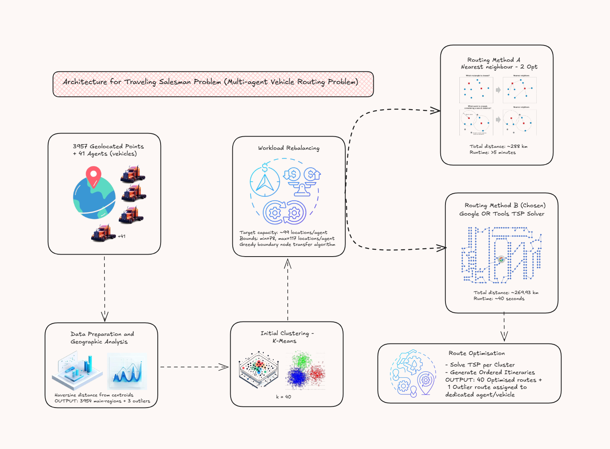

# Traveling Sales Man Problem — Multi‑Agent Vehicle Routing Problem (VRP)

## Architecture Diagram



       

Executive summary
-----------------
This repository packages the original analysis for a multi‑agent Vehicle Routing Problem (VRP) variant of the Traveling Sales Man Problem. The dataset includes ~3957 geolocated points and 41 agents. The solution goal: assign every location to a single agent, compute an ordered route per agent, and minimize combined travel distance while balancing per‑agent workloads.

Key results (from notebook)
- Raw locations: 3957; main-region after outlier removal: 3954.
- Rebalanced clusters (40 main agents): min=78, max=117, mean≈98.85 locations/agent.
- Final OR‑Tools solution: combined distance ≈ 269.93 km (avg ≈ 6.92 km/agent, std ≈ 2.48 km), run time ≈ 40s.

Files in this folder
- `TSP_Problem.ipynb` — full analysis, EDA, clustering, rebalancer and solver cells.
- `TSP1.xlsm` — original Excel dataset (locations and 41 agents sheet).
- `Solution Approach Summary.docx` / `.pdf` — original summary document.
- `Map_of_final_routes.png` — exported final route map (embedded in README).

Embed: Map of final routes


Data schema (expected input)
- `location_id` — unique identifier (string or int)
- `latitude` — float (WGS84 degrees)
- `longitude` — float (WGS84 degrees)
- optional: `address`, `service_time`, `demand`

Data preparation (what the notebook does)
1. Read `TSP1.xlsm`, map columns to the schema above.
2. Validate: check nulls, duplicates, lat/lon bounds.
3. Compute global centroid and per‑point Haversine distance distribution.
4. Identify and isolate geographic outliers (3 points in this dataset).

Clustering and workload balancing
---------------------------------
Approach summary:
1. Apply K‑Means with k = number of agents to get an initial spatial partition.
2. Compute desired capacity: target = floor(N / agents), with tolerance bounds (used: 78–117).
3. Greedy rebalancing: move boundary nodes from overloaded clusters to nearest underloaded clusters while preserving geographic compactness.

Rebalancer pseudocode
```
Input: clusters, lower_bound, upper_bound
Compute centroids for all clusters
While exists cluster C with size > upper_bound:
  for node in boundary_nodes_of(C) sorted by distance_to_centroid_desc:
    D = nearest cluster to node with size < upper_bound
    if D and D.size + 1 <= upper_bound:
      move node from C to D
      update centroids for C and D
      break if C.size <= upper_bound
```

Routing methods compared
------------------------
- Nearest‑Neighbor + 2‑opt: simple, produced total ≈ 288 km, runtime > 5 minutes.
- OR‑Tools per‑cluster TSP (final): produced total ≈ 269.93 km, runtime ≈ 40 seconds. OR‑Tools chosen for scalability, constraint support and performance.

Distance model — Haversine (why and how)
----------------------------------------
We compute pairwise distances using the Haversine great‑circle formula which approximates geodesic distance on a sphere; it is compact and numerically stable for our spatial extent. The formula (lat/lon in radians):

$$
\Delta\varphi = \varphi_2 - \varphi_1, \quad \Delta\lambda = \lambda_2 - \lambda_1
$$

$$
a = \sin^2\left(\frac{\Delta\varphi}{2}\right) + \cos(\varphi_1)\cos(\varphi_2)\sin^2\left(\frac{\Delta\lambda}{2}\right)
$$

$$
d = 2R\,\arcsin(\sqrt{a})
$$

Python snippet (Haversine):
```python
import math
def haversine(lat1, lon1, lat2, lon2, R=6371.0):
    phi1, phi2 = math.radians(lat1), math.radians(lat2)
    dphi = math.radians(lat2 - lat1)
    dlambda = math.radians(lon2 - lon1)
    a = math.sin(dphi/2)**2 + math.cos(phi1)*math.cos(phi2)*math.sin(dlambda/2)**2
    return 2 * R * math.asin(math.sqrt(a))
```

Note: for ellipsoidal accuracy use `pyproj.Geod` or `GeographicLib`.

OR‑Tools configuration (how the notebook used it)
------------------------------------------------
- Convert pairwise distances to integer meters (km*1000 → int) for OR‑Tools.
- For each cluster solve a single‑vehicle TSP using `RoutingIndexManager` + `RoutingModel`.
- Use `PATH_CHEAPEST_ARC` first solution + `GUIDED_LOCAL_SEARCH` metaheuristic and per‑cluster time limits.

Simplified OR‑Tools example (per cluster)
```python
from ortools.constraint_solver import pywrapcp, routing_enums_pb2

def solve_cluster_tsp(distance_matrix, time_limit_s=2):
    n = len(distance_matrix)
    manager = pywrapcp.RoutingIndexManager(n, 1, 0)
    routing = pywrapcp.RoutingModel(manager)

    def callback(i, j):
        return int(distance_matrix[manager.IndexToNode(i)][manager.IndexToNode(j)])

    transit_idx = routing.RegisterTransitCallback(callback)
    routing.SetArcCostEvaluatorOfAllVehicles(transit_idx)

    params = pywrapcp.DefaultRoutingSearchParameters()
    params.first_solution_strategy = routing_enums_pb2.FirstSolutionStrategy.PATH_CHEAPEST_ARC
    params.local_search_metaheuristic = routing_enums_pb2.LocalSearchMetaheuristic.GUIDED_LOCAL_SEARCH
    params.time_limit.seconds = time_limit_s

    solution = routing.SolveWithParameters(params)
    # extract route
    return solution
```

Reproducing the notebook results (quick steps)
--------------------------------------------
1. Create venv and install requirements:
```powershell
python -m venv .venv
.\.venv\Scripts\Activate.ps1
pip install -r requirements.txt
```
2. Open `TSP_Problem.ipynb` in Jupyter Lab and run cells in order.
3. Run clustering + rebalancer cells (tolerance bounds: 78–117).
4. Precompute distance matrices per cluster and run OR‑Tools solver cells (set `time_limit_s` per cluster to trade runtime/quality).
5. Aggregate per‑agent results and export `final_routes.geojson` and `Map_of_final_routes.png`.

Export examples
---------------
Export per‑agent summary CSV:
```python
import csv
with open('assets/route_summary.csv','w',newline='') as f:
    writer = csv.writer(f)
    writer.writerow(['agent_id','route_distance_km','node_count'])
    for agent,stats in summary.items():
        writer.writerow([agent,stats['distance_km'],stats['nodes']])
```

Export GeoJSON (LineString per agent):
```python
import geojson
features = [geojson.Feature(geometry=geojson.LineString(coords), properties={'agent':agent}) for agent,coords in routes.items()]
geojson.dump(geojson.FeatureCollection(features), open('assets/final_routes.geojson','w'))
```

Evaluation metrics
------------------
- Combined distance (km)
- Per‑agent distance (km), node count
- Fairness: mean, std dev, max/min ratio, and maximum route length
- Runtime per cluster and total runtime

Notes, caveats & next steps
--------------------------
- OR‑Tools delivered the best balance of quality and runtime on this dataset; for road‑accurate distances replace Haversine with OSRM/GraphHopper distances.
- For production, convert notebook code to modules (data_ingest.py, cluster_rebalance.py, solver.py, export.py) and expose via a backend (FastAPI) with job queuing (Celery/Redis).
