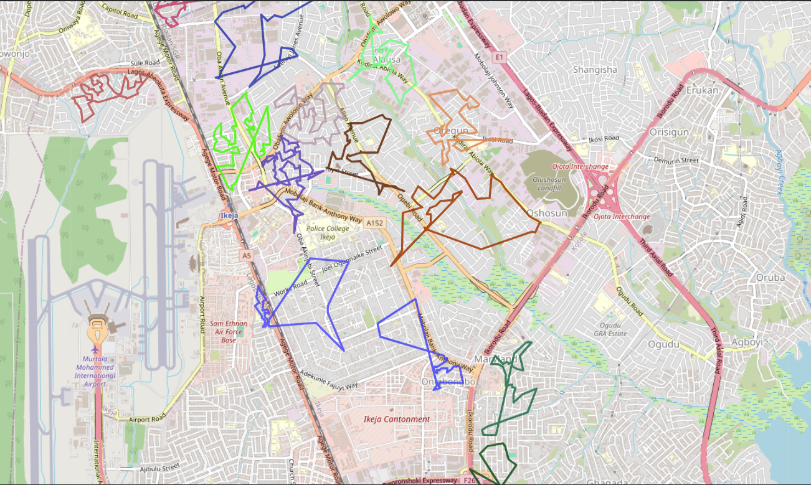

# Traveling Sales Man Problem — Multi‑Agent Vehicle Routing Problem (VRP)

       

Executive summary
-----------------
This repository packages the original analysis for a multi‑agent Vehicle Routing Problem (VRP) variant of the Traveling Sales Man Problem. The dataset includes ~3957 geolocated points and 41 agents. The solution goal: assign every location to a single agent, compute an ordered route per agent, and minimize combined travel distance while balancing per‑agent workloads.

Key results (from notebook)
- Raw locations: 3957; main-region after outlier removal: 3954.
- Rebalanced clusters (40 main agents): min=78, max=117, mean≈98.85 locations/agent.
- Final OR‑Tools solution: combined distance ≈ 269.93 km (avg ≈ 6.92 km/agent, std ≈ 2.48 km), run time ≈ 40s.

Files in this folder
- `TSP_Problem.ipynb` — full analysis, EDA, clustering, rebalancer and solver cells.
- `TSP1.xlsm` — original Excel dataset (locations and 41 agents sheet).
- `Solution Approach Summary.docx` / `.pdf` — original summary document.
- `Map_of_final_routes.png` — exported final route map (embedded in README).

Embed: Map of final routes



Data schema (expected input)
- `location_id` — unique identifier (string or int)
- `latitude` — float (WGS84 degrees)
- `longitude` — float (WGS84 degrees)
- optional: `address`, `service_time`, `demand`

Data preparation (what the notebook does)
1. Read `TSP1.xlsm`, map columns to the schema above.
2. Validate: check nulls, duplicates, lat/lon bounds.
3. Compute global centroid and per‑point Haversine distance distribution.
4. Identify and isolate geographic outliers (3 points in this dataset).

Clustering and workload balancing
---------------------------------
Approach summary:
1. Apply K‑Means with k = number of agents to get an initial spatial partition.
2. Compute desired capacity: target = floor(N / agents), with tolerance bounds (used: 78–117).
3. Greedy rebalancing: move boundary nodes from overloaded clusters to nearest underloaded clusters while preserving geographic compactness.

Rebalancer pseudocode
```
Input: clusters, lower_bound, upper_bound
Compute centroids for all clusters
While exists cluster C with size > upper_bound:
  for node in boundary_nodes_of(C) sorted by distance_to_centroid_desc:
    D = nearest cluster to node with size < upper_bound
    if D and D.size + 1 <= upper_bound:
      move node from C to D
      update centroids for C and D
      break if C.size <= upper_bound
```

Routing methods compared
------------------------
- Nearest‑Neighbor + 2‑opt: simple, produced total ≈ 288 km, runtime > 5 minutes.
- OR‑Tools per‑cluster TSP (final): produced total ≈ 269.93 km, runtime ≈ 40 seconds. OR‑Tools chosen for scalability, constraint support and performance.

Distance model — Haversine (why and how)
----------------------------------------
We compute pairwise distances using the Haversine great‑circle formula which approximates geodesic distance on a sphere; it is compact and numerically stable for our spatial extent. The formula (lat/lon in radians):

$$
\Delta\varphi = \varphi_2 - \varphi_1, \quad \Delta\lambda = \lambda_2 - \lambda_1
$$

$$
a = \sin^2\left(\frac{\Delta\varphi}{2}\right) + \cos(\varphi_1)\cos(\varphi_2)\sin^2\left(\frac{\Delta\lambda}{2}\right)
$$

$$
d = 2R\,\arcsin(\sqrt{a})
$$

Python snippet (Haversine):
```python
import math
def haversine(lat1, lon1, lat2, lon2, R=6371.0):
    phi1, phi2 = math.radians(lat1), math.radians(lat2)
    dphi = math.radians(lat2 - lat1)
    dlambda = math.radians(lon2 - lon1)
    a = math.sin(dphi/2)**2 + math.cos(phi1)*math.cos(phi2)*math.sin(dlambda/2)**2
    return 2 * R * math.asin(math.sqrt(a))
```

Note: for ellipsoidal accuracy use `pyproj.Geod` or `GeographicLib`.

OR‑Tools configuration (how the notebook used it)
------------------------------------------------
- Convert pairwise distances to integer meters (km*1000 → int) for OR‑Tools.
- For each cluster solve a single‑vehicle TSP using `RoutingIndexManager` + `RoutingModel`.
- Use `PATH_CHEAPEST_ARC` first solution + `GUIDED_LOCAL_SEARCH` metaheuristic and per‑cluster time limits.

Simplified OR‑Tools example (per cluster)
```python
from ortools.constraint_solver import pywrapcp, routing_enums_pb2

def solve_cluster_tsp(distance_matrix, time_limit_s=2):
    n = len(distance_matrix)
    manager = pywrapcp.RoutingIndexManager(n, 1, 0)
    routing = pywrapcp.RoutingModel(manager)

    def callback(i, j):
        return int(distance_matrix[manager.IndexToNode(i)][manager.IndexToNode(j)])

    transit_idx = routing.RegisterTransitCallback(callback)
    routing.SetArcCostEvaluatorOfAllVehicles(transit_idx)

    params = pywrapcp.DefaultRoutingSearchParameters()
    params.first_solution_strategy = routing_enums_pb2.FirstSolutionStrategy.PATH_CHEAPEST_ARC
    params.local_search_metaheuristic = routing_enums_pb2.LocalSearchMetaheuristic.GUIDED_LOCAL_SEARCH
    params.time_limit.seconds = time_limit_s

    solution = routing.SolveWithParameters(params)
    # extract route
    return solution
```

Reproducing the notebook results (quick steps)
--------------------------------------------
1. Create venv and install requirements:
```powershell
python -m venv .venv
.\.venv\Scripts\Activate.ps1
pip install -r requirements.txt
```
2. Open `TSP_Problem.ipynb` in Jupyter Lab and run cells in order.
3. Run clustering + rebalancer cells (tolerance bounds: 78–117).
4. Precompute distance matrices per cluster and run OR‑Tools solver cells (set `time_limit_s` per cluster to trade runtime/quality).
5. Aggregate per‑agent results and export `final_routes.geojson` and `Map_of_final_routes.png`.

Export examples
---------------
Export per‑agent summary CSV:
```python
import csv
with open('assets/route_summary.csv','w',newline='') as f:
    writer = csv.writer(f)
    writer.writerow(['agent_id','route_distance_km','node_count'])
    for agent,stats in summary.items():
        writer.writerow([agent,stats['distance_km'],stats['nodes']])
```

Export GeoJSON (LineString per agent):
```python
import geojson
features = [geojson.Feature(geometry=geojson.LineString(coords), properties={'agent':agent}) for agent,coords in routes.items()]
geojson.dump(geojson.FeatureCollection(features), open('assets/final_routes.geojson','w'))
```

Evaluation metrics
------------------
- Combined distance (km)
- Per‑agent distance (km), node count
- Fairness: mean, std dev, max/min ratio, and maximum route length
- Runtime per cluster and total runtime

OCR & input ingestion
---------------------
If input needs to be extracted from images or PDFs, the notebook supports using either:
- `pytesseract` (local Tesseract OCR)
- `google-cloud-vision` for higher accuracy at scale

Keep raw OCR output and a log file listing `file, ocr_success, extracted_text, notes` for reproducibility.

Notes, caveats & next steps
--------------------------
- OR‑Tools delivered the best balance of quality and runtime on this dataset; for road‑accurate distances replace Haversine with OSRM/GraphHopper distances.
- For production, convert notebook code to modules (data_ingest.py, cluster_rebalance.py, solver.py, export.py) and expose via a backend (FastAPI) with job queuing (Celery/Redis).

License & contact
-----------------
Add a `LICENSE` (e.g., MIT) if you plan to publish this repository. If you want me to push this repo to GitHub or scaffold the web app (`web_app_repo`) with a minimal FastAPI + React prototype, tell me which next step you prefer.
# Traveling Sales Man Problem — Multi‑Agent Vehicle Routing Problem (VRP)


Overview
--------
This repository contains the original analysis, data, and final route artifacts for the Traveling Sales Man Problem framed as a multi‑agent Vehicle Routing Problem (VRP). The dataset includes 41 agents and a set of geographic points (latitude/longitude). The objective:

- Assign every location to a single agent (each location visited exactly once).
- Produce ordered routes per agent (return-to-depot optional by scenario).
- Minimize the combined travel distance while keeping per‑agent workloads balanced.

The content below is a concise distillation of the `Solution Approach Summary` document included in this folder; numeric results and constraints are preserved from that analysis.

Key numeric summary
-------------------
- Raw locations: 3957 points.
- Outliers: 3 extreme points were assigned to a dedicated agent and excluded from main-region balancing, leaving 3954 locations for balanced distribution across 40 main agents.
- Target workload per main agent: ~99 locations (acceptable bounds: 78–117). After rebalancing the clusters: min=78, max=117, mean≈98.85.
- Final combined travel distance (OR‑Tools): 269.93 km (avg ≈ 6.92 km per agent, std ≈ 2.48 km), run time ≈ 40s.

Data preparation & geographic structure
-------------------------------------
The dataset is latitude/longitude coordinates. The notebook performs:

- Basic validation (nulls, duplicates), coordinate sanity checks.
- Global center and per‑point distance distribution analysis (Haversine).
- Outlier detection: 3 points were geographically distant and treated separately.

Agent assignment & workload balancing
------------------------------------
Initial K‑Means clustering (k = number of agents) produced extreme imbalance. A capacity‑constrained rebalancing step redistributed boundary points from overloaded clusters to nearby underloaded clusters until all clusters fell within the target bounds (78–117). Boundary transfer used distance‑to‑centroid heuristics to preserve geographic compactness.

Routing approaches compared
-------------------------
1) Nearest‑Neighbor + 2‑opt

- Simple greedy construction followed by 2‑opt local improvement.
- Produces reasonable routes but was slower in aggregate (nested loops, quadratic local search). Total distance ≈ 288 km in experiments and runtime > 5 minutes.

2) Google OR‑Tools (selected final approach)

- Each agent’s route was solved as an independent TSP within its assigned cluster using OR‑Tools RoutingModel with Guided Local Search and strict per‑agent time limits.
- Distances were provided as integer meters computed from geodesic (Haversine) calculations.
- Outcome: improved total distance (269.93 km), reduced runtime (~40s), and low dispersion across agents (std ≈ 2.48 km).

Distance model (Haversine)
-------------------------
We use great‑circle geodesic distance (Haversine) for pairwise distances. The Haversine formula is:

$$
\Delta\varphi = \varphi_2 - \varphi_1, \quad \Delta\lambda = \lambda_2 - \lambda_1
$$

$$
a = \sin^2\left(\frac{\Delta\varphi}{2}\right) + \cos(\varphi_1)\cos(\varphi_2)\sin^2\left(\frac{\Delta\lambda}{2}\right)
$$

$$
d = 2R\,\arcsin(\sqrt{a})
$$

where $\varphi$ are latitudes in radians, $\lambda$ are longitudes in radians, and $R$ is Earth radius (mean ≈ 6371 km). This model is compact and accurate for routing prototypes; for production systems requiring ellipsoidal accuracy use `pyproj.Geod` or `GeographicLib`.

Why Haversine: lat/lon are angular coordinates—Euclidean distances in raw lat/lon distort real distances, especially across larger extents.

Visualization & exports
----------------------
- Per-agent route summary: exported CSV with `agent_id, route_distance_km, node_count`.
- GeoJSON export: `final_routes.geojson` for direct overlay in Mapbox or Leaflet.
- Static export: `Map_of_final_routes.png` (embedded above). Replace with high‑res export as needed.

Tech stack & tools
------------------
- Core: Python 3.10+, pandas, NumPy
- Geospatial: GeoPandas, Shapely, PyProj, GeoJSON
- Distances: geopy / GeographicLib / pyproj.Geod
- Solver: Google OR‑Tools (RoutingModel) — chosen for performance and constraint support
- Visualization: matplotlib, Plotly (notebook); Mapbox GL JS or Leaflet for web mapping
- OCR (if needed for input ingestion): Tesseract (`pytesseract`) or Google Cloud Vision API

Reproducibility
---------------
Create an environment and install dependencies (example):

```powershell
python -m venv .venv
.\.venv\Scripts\Activate.ps1
pip install -r requirements.txt
```

Open `TSP_Problem.ipynb` and run cells in order. The notebook includes data preparation, clustering, rebalancing, solver invocation (OR‑Tools), and visualization/export steps.

Notes & next steps
------------------
- OR‑Tools produced the best tradeoff between solution quality and runtime for this dataset; if road network distances are required, replace the Haversine matrix with OSRM/GraphHopper distances.
- For large scale or repeated solves, convert the per‑agent solves into a backend job queue (FastAPI + Celery/Redis) and use caching for distance matrices.

Contact & license
-----------------
Add a `LICENSE` if you intend to publish. If you want, I can push this repo to GitHub or scaffold the web app repository next.


Quick links
-----------
- Notebook: `TSP_Problem.ipynb`
- Original data: `TSP1.xlsm` (includes a sheet listing the 41 agents)
- Summary: `Solution Approach Summary.pdf` / `Solution Approach Summary.docx`
- Final routes map (embedded):


Problem & data
--------------
The primary dataset contains location coordinates (latitude, longitude). A separate sheet lists 41 agents. The assignment goal is to allocate locations to the 41 agents and produce ordered routes per agent.

Solution summary
----------------
Two complementary strategies were explored in the notebook:

1) Balanced partition + per‑cluster TSP

- Partition the entire location set into 41 spatially coherent clusters (balanced by node count or estimated workload).
- Solve an independent TSP within each cluster (local improvement: 2‑opt, 3‑opt; optionally LKH for higher quality).
- Pros: parallel solves and fast. Cons: cluster boundaries may cause suboptimal global routing.

2) Single‑stage Vehicle Routing Problem (VRP)

- Model the problem as a multi‑vehicle VRP with 41 vehicles using Google OR‑Tools RoutingModel.
- Use a geodesic distance callback (Haversine or GeographicLib) for accurate earth‑curved distances.
- Add soft constraints or objective penalties to balance route lengths (minimize variance or minimize the maximum route length).
- Pros: captures global interactions and supports constraints (capacities, time windows). Cons: higher compute and solver tuning.

Distance computation (why Haversine)
----------------------------------
Euclidean straight lines on latitude/longitude are incorrect for geographic distances. For reasonably sized geographic extents the Haversine great‑circle formula gives a simple, efficient, and accurate distance model. The Haversine distance between two points with latitudes $\varphi_1,\varphi_2$ and longitudes $\lambda_1,\lambda_2$ (in radians) using Earth radius $R$ is:

$$
\Delta\varphi = \varphi_2 - \varphi_1, \quad \Delta\lambda = \lambda_2 - \lambda_1
$$

$$
a = \sin^2\left(\frac{\Delta\varphi}{2}\right) + \cos(\varphi_1)\cos(\varphi_2)\sin^2\left(\frac{\Delta\lambda}{2}\right)
$$

$$
d = 2R\,\arcsin(\sqrt{a})
$$

This calculation is compact, numerically stable for small distances, and widely used in routing prototypes. For maximum geodetic accuracy (ellipsoidal Earth), use `pyproj.Geod` or `GeographicLib`.

Why not straight lines?
- Lat/lon are angular coordinates; straight Euclidean distance in lat/lon space distorts distances (especially at higher latitudes).

Tech stack (high level)
-----------------------
- Python 3.10+ — core implementation language.
- pandas, numpy — data handling and numeric work.
- geopandas, shapely, pyproj — geospatial helpers and geometry processing.
- geopy / geographiclib — geodesic distance tools (Haversine or more accurate options).
- OR‑Tools — routing solver (VRP) and local search.
- matplotlib / plotly — static and interactive plotting.
- Mapbox GL JS or Leaflet (for web mapping visualizations).
- Tesseract (`pytesseract`) and/or Google Cloud Vision — OCR tools for data ingestion when needed.

Reproducibility & setup
-----------------------
Suggested Python environment commands:

```powershell
python -m venv .venv
.\.venv\Scripts\Activate.ps1
pip install -r requirements.txt
```

Minimal `requirements.txt` (examples)

```
pandas
numpy
geopandas
pyproj
geopy
ortools
matplotlib
plotly
pytesseract
jupyterlab
```

Visualization & exports
-----------------------
- The notebook exports per‑agent route summaries (CSV) and a GeoJSON of the final routes.
- Maps are rendered using geodesic polylines; where the map provider supports it, use native great‑circle arcs or interpolate intermediate points between lat/lon pairs to create smooth curved lines.

Evaluation metrics
------------------
- Total distance (sum of all agent routes).
- Per‑agent distance and node count.
- Fairness: max route length, mean and standard deviation, and max/min ratio.
- Runtime and solver status.

Files in this folder
--------------------
- `TSP_Problem.ipynb` — full analysis and experiments.
- `TSP1.xlsm` — original Excel dataset (locations + agents).
- `Solution Approach Summary.pdf` / `.docx` — design notes.
- `Map_of_final_routes.png` — exported map image used above.

License & contact
-----------------
Add a license file (e.g., `LICENSE` with MIT) if you intend to publish. For help pushing this repository to GitHub or scaffolding the web app, open an issue or contact the author.

Acknowledgements
----------------
Workflows and recommendations in this README are based on the analysis in `TSP_Problem.ipynb` and the `Solution Approach Summary` documents found in this folder.
